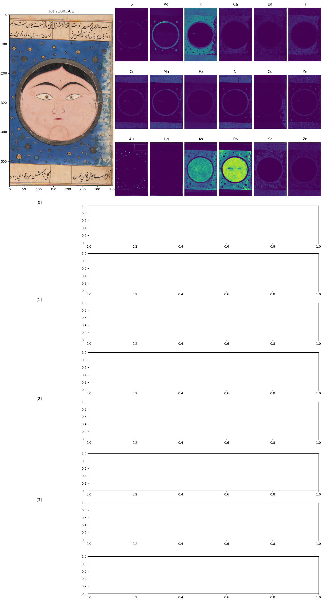

# A dashboard for exploring MA-XRF data


<!-- WARNING: THIS FILE WAS AUTOGENERATED! DO NOT EDIT! -->

Now that we have downloaded all MA-XRF data we can start to explore them
by initializing the
[`Falnama_maxrf_data()`](https://fligt.github.io/falnama-dev/functions/it-all-starts-with-fair-data.html#falnama_maxrf_data)
class. Which elements are present in the paints and other materials of
pages that we scanned?

``` python
from falnama import Falnama_maxrf_data
```

``` python
import maxrf4u as mx
import matplotlib.pyplot as plt
```

``` python
maxrf_data = Falnama_maxrf_data()
```

On my machine the data is already downloaded into the cache. In theory
we should be able to efficiently check the file hashes with the
`.download_all()` method. Unfortunately for these big files that reside
on our network just calculating the hashes takes almost 10 minutes! So
for now we simply skip this check and start working with the cached
datastack files that contain our MA-XRF data.

``` python
datastack_files = maxrf_data.get_datastack_files()
datastack_files
```

    ['/media/frank/lonprojecten/2024-811_falnama-project/data/interim/maxrf/datastacks/WM-71803-01_400_600_50.datastack',
     '/media/frank/lonprojecten/2024-811_falnama-project/data/interim/maxrf/datastacks/WM-71803-03_250_300_50.datastack',
     '/media/frank/lonprojecten/2024-811_falnama-project/data/interim/maxrf/datastacks/WM-71803-08_250_300_50.datastack',
     '/media/frank/lonprojecten/2024-811_falnama-project/data/interim/maxrf/datastacks/WM-71803-10_250_300_50.datastack',
     '/media/frank/lonprojecten/2024-811_falnama-project/data/interim/maxrf/datastacks/WM-71803-12_250_300_50.datastack',
     '/media/frank/lonprojecten/2024-811_falnama-project/data/interim/maxrf/datastacks/WM-71803-13_400_600_50.datastack',
     '/media/frank/lonprojecten/2024-811_falnama-project/data/interim/maxrf/datastacks/WM-71803-17_400_600_50.datastack',
     '/media/frank/lonprojecten/2024-811_falnama-project/data/interim/maxrf/datastacks/WM-71803-18_400_300_50_det.datastack',
     '/media/frank/lonprojecten/2024-811_falnama-project/data/interim/maxrf/datastacks/WM-71803-18_400_500_50.datastack',
     '/media/frank/lonprojecten/2024-811_falnama-project/data/interim/maxrf/datastacks/WM-71803-19_400_600_50.datastack',
     '/media/frank/lonprojecten/2024-811_falnama-project/data/interim/maxrf/datastacks/WM-71803-23_400_600_50.datastack',
     '/media/frank/lonprojecten/2024-811_falnama-project/data/interim/maxrf/datastacks/WM-71803-24_400_600_50.datastack',
     '/media/frank/lonprojecten/2024-811_falnama-project/data/interim/maxrf/datastacks/WM-71803-29_400_500_50.datastack',
     '/media/frank/lonprojecten/2024-811_falnama-project/data/interim/maxrf/datastacks/WM-71803-30_250_300_50.datastack',
     '/media/frank/lonprojecten/2024-811_falnama-project/data/interim/maxrf/datastacks/WM-71803-31_400_600_50.datastack',
     '/media/frank/lonprojecten/2024-811_falnama-project/data/interim/maxrf/datastacks/WM-71803-35_400_500_50.datastack']

Here is a thumbnail overview plot of all the scanned areas.

``` python
imvis_list = []
extent_list = []
for datastack_file in datastack_files: 
    ds = mx.DataStack(datastack_file)
    im = ds.read('imvis_reg')
    extent = ds.read('imvis_extent')
    imvis_list.append(im)
    extent_list.append(extent)
```

``` python
fig, axs = plt.subplots(ncols=8, nrows=2, figsize=[20, 10])
axs = axs.flatten()
for i, [im, ax, extent] in enumerate(zip(imvis_list, axs, extent_list)): 
    ax.imshow(im, extent=extent)
    ax.set_title(i)
```


``` python
from falnama import Dashboard
```

Here is a dashboard plot for our first datastack file.

``` python
dash_0 = Dashboard(datastack_files[0])
```



``` python
dash_0.add_roi(0, *dash_0.get_selection_coords())
```

Mm, for some reason the scaling of the roi image and spectra changes…

## FUNCTIONS

------------------------------------------------------------------------

<a
href="https://github.com/fligt/falnama-dev/blob/master/falnama/dashboard.py#L18"
target="_blank" style="float:right; font-size:smaller">source</a>

### Dashboard

>  Dashboard (datastack_file=None, roi_count=4, data=None, eq_emap=False)

\*Create a dashboard for analyzing spectras on regions of interest

datastack_files: A list of datastack_file paths, does accept a singular
string.

roi_count: The amount of region of interest shown in the dashboard.
Default is 10.\*
